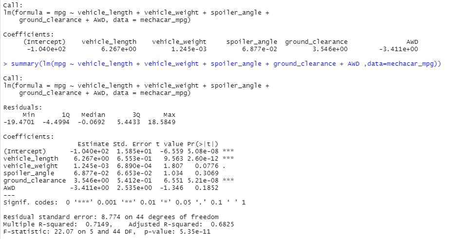
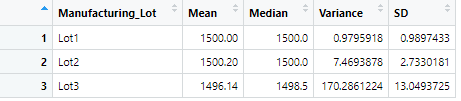
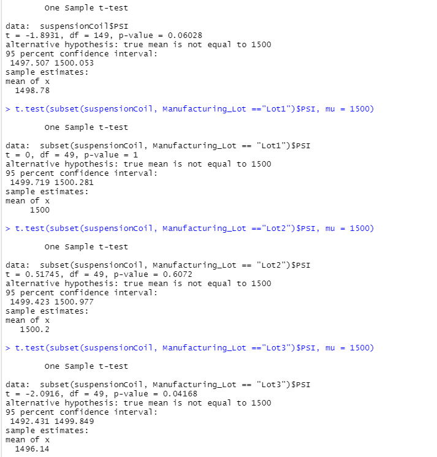

# MechaCar_Statistical_Analysis

## Overview
The MechaCar, AutoRUs' newest prototype has been suffering from production troubles stopping the manufacturing team's progress. This analysis was performed to provide insights by using statistical tests. 

## Linear Regression to Predict MPG
1) Which variables/coefficients provided a non-random amount of variance to the mpg values in the dataset?
- Vehicle Length and Ground Clearance
2) Is the slope of the linear model considered to be zero? Why or why not?
- The slope of linear model is not zero because there are variables correlating with mpg. 
3) Does this linear model predict mpg of MechaCar prototypes effectively? Why or why not?
- The R-squared value predicted the MechaCar prototypes mpg values 71.49% of the time, which is reasonably high enough to say yes it does predict mpg. Many factors could increase the effectiveness of this model. 

## Summary Statistics on Suspension Coils
1) The design specifications for the MechaCar suspension coils dictate that the variance of the suspension coils must not exceed 100 pounds per square inch. Does the current manufacturing data meet this design specification for all manufacturing lots in total and each lot individually? Why or why not?
- Lot 1 and 2 meet the above specification but Lot 3 does not with a high variance of 170 psi. 

## T-Tests on Suspension Coils

- Distribution is normal because our p-value is at 0.06, higher than the standard of 0.05
- Lot 1 and 2 have normal distribution. (p-values of 1, and 0.06)
- Lot 3 has a p-value of 0.04 which is lower than the standard. Therefore we cannot assume normal distribution

## Study Design: MechaCar vs Competition
Horse Power, horse power, horse power... My statistical study will focuse on the towing capacity of MechaCar vs the competition. Horse power will be the metric used asssuming this metric is analagous with towing capacity. My null hypothesis is that the MechaCars have a higher horse power than that of the competition. My alternative hypothesis is that they do not have higher horse power. The study will use a Two-sample t-Test becuase it will compare two samples of dichotomous data. The study will require data on the competitions horse power compared with the MechaCar data horse power. 

